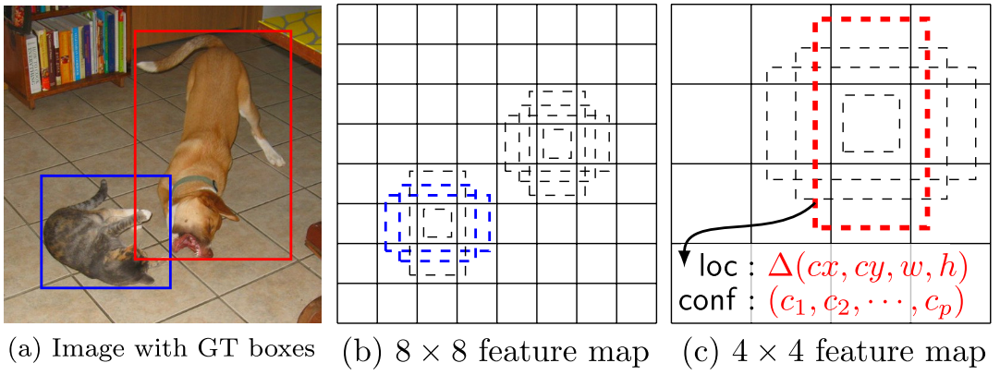

# Review of SSD Singel Shot Multibox Detector

## Wei Liu, Dragonmir Anguelov, Dumitru Erhan, Christian Szegedy, Scott Reed, Cheng-Yang Fu, Alexander C. Berg

Comparado a Fast y Faster Rcnn arquitecturas construidas en dos etapas separadas para la clasificacion y prediccion de bounding boxes, lo que los hace buenos en mAP pero SSD elimina la parte de region proposals (regiones propuestas) y evita el redimensionamiento sobre los mapas de caracteristicas. SDD encapsula toda la computacion en una sola red. con un SSD trabajado en imagenes de 300x300 alcanza 74.3% mAP a 59 FPS
para imagenes de 512x512 alcanza un 76.9% mAP lo cual mejora a la arquitecturas previas de dos niveles.

Comparado a arquitecturas en base a RCNN y usando dos etapas supera en mAP mientras comparado a YOLO arquitectura de una sola etapa supera en velocidad y mAP.

SSD usa filtros predictores separados para diferentes detecciones ratios de aspecto sobre la imagen, aplica estos filtros a multiples mapas de caracteristicas de las ultima capas de la red, con el objetivo de realizar las predicciones a diferentes escalas.

SSD usa bounding boxes por defecto (fijo) que con los pequeños filtros convolucionales predicen el score de la categoria y el desplazamiento del bounding box

SSD predice a diferentes escalas con mapas de caracteristicas a diferentes escalas, separados por el ratio de aspecto de la imagen

Figura 1

En la figura 1 a se puede observar la manera de deteccion, SSD trabaja con bounding boox fijos por defecto con diferentes aspect ratio que dan la posibilidad de tener diferentes formas de los bounding box (tiling) puede ser que el enmarcado sea de manera más rectangular o cuadragunlar o rectangular crecido de manera horizontal o vertical cualquiera de estas opciones esta enmarcada en los diferentes aspect ratios.

Por otro lado al trabajar las detecciones en diferentes capas finales de la red tiene la posibilidad de trabajar con difentes escalas de los mapas de caracteristicas, como se observa en la imagen hay un mapa de carateristicas de 8X8 de dimension y 4X4 de dimension con los bounding box escalados respectivamente a dicha capa. Lo que da la posibilidad de detectar objetos grandes y pequeños como es el caso del gato (azul) y perro (rojo) respectivamente y hacer simultaneamente la categorizacion de la clase y la prediccion del desplazamiento de las cajas ya que hará el respectivo matching con aquel grountruth de bounding box que sobrelape más (esto es aplicando la metrica de jaccard o iou) la cajas restantes en negro son cajas negativas (no pertenecen a ninguna clase)(cajas no buenas) ayudan también a que la red distinga en que es un buen bounding box y cual no. El loss es ponderado para albergar 2 objetivos simultaneos.

